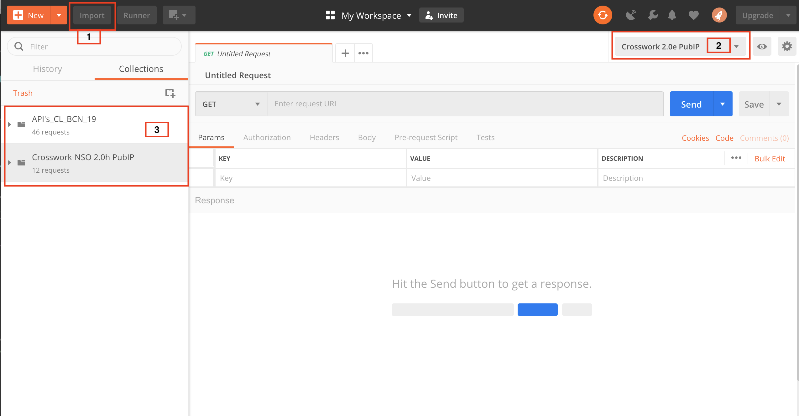

# Postman collections for Cisco Crosswork Network Change Automation and Health Insights APIs

This public repo contains a [POSTMAN](https://getpostman.com) collections that can be used to interact with Cisco Crosswork Network Change Automation ("NCA") and Health Insights ("HI") APIs.

The colloections are desinged to help you get srated with using APIs with Crosswork NCA and HI, feel free to modify them as you see fit and to add more calls to the collection.

# Requirements

The NCA and HI Postman collections will need:
* Postman 6.7.0 +
* Cisco Crosswork NCA and HI 3.0 +  
* Cisco NSO 4.5.5 + 

# Setup 

If you don't have Postman already installed, you can download it from [here](https://getpostman.com). Once you install it, you can follow the steps below to import the collection and environment:

1. Click on `Import`, browse to the location where you cloned this repo and add the two files:
    1. `pub-ip-env.json`
    2. `pub-ip-coll.json`
    3. `API's_CL_BCN_19.postman_collection.json`
2. Make sure you select the `Crosswork 2.0e PubIP` environment
3. Expand the collections
4. Review our DevNet page [Cisco Crosswork DevNet page](https://developer.cisco.com/)
5. Start making APIs calls

